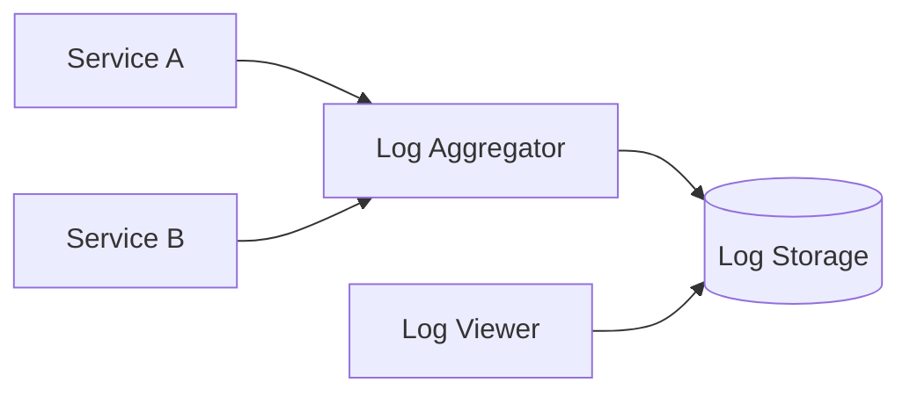
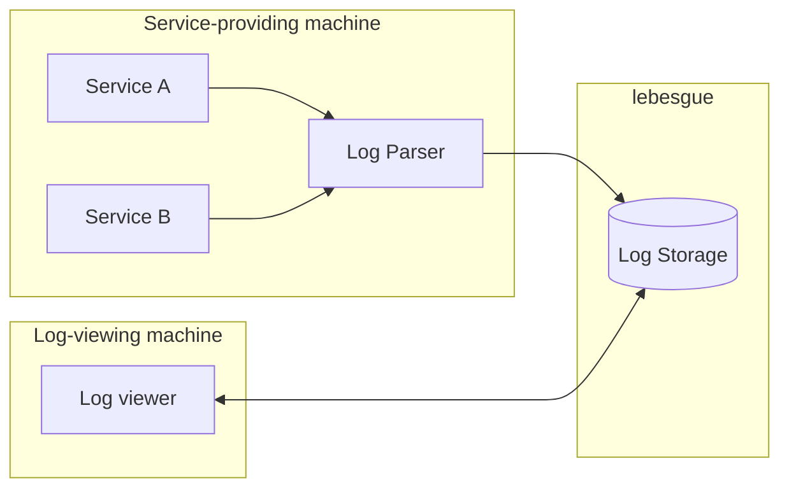
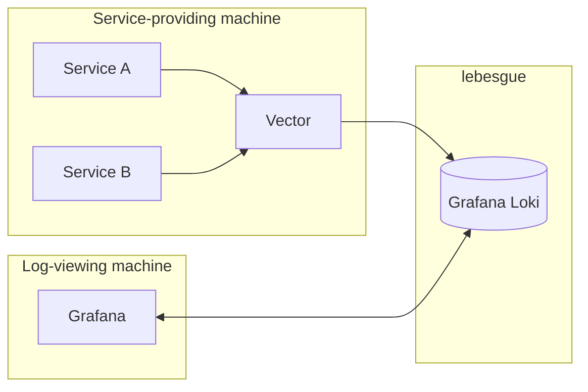

# Homelab Refresh 004 - Logging

#### Benjamin Godfrey

Something which is easy to overlook when jumping into homelabbing is setting up a system for logging. When things start going wrong, it will be handy to know why. As such, we want to keep a hold of some of the output from our services. There are a few components to this, so it would be handy to first figure out what our logging solution should look like.

My first thoughts are something along these lines. Send all of the logs to one machine, parse them to keep some consistency, and store them. Immediately, I am also thinking it makes sense for this machine to be `lebesgue`, the older Raspberry Pi in my network. This is the machine with the worst performance, and logging is an area where this should not matter.

Those are the broad strokes which I am going in with, now we want to iron out some details.

## Gathering logs

### Services

All of my services will create logs, and these logs will most likely differ in structure service-to-service. To mitigate this, we want some sort of standardisation or parsing layer. I would also say that this should take place before the aggregation, otherwise we might start duplicating data which we do not need. In fact, to this end, we should probably have our logs be parsed and standardised on the machine which is producing them, and then sent away off to `lebesgue`. Our flow then starts to look more like this:

Now we have a few choices to make. Namely:

- What should our log parser be?
- What should our log storage be?
- What should our log viewer be?

There are a few options for each of these, and to be honest, this is the first time in my homelab setup process where I don't instantly have a preference.

#### Log Parser

For each machine, we want to be able to define:

- Where logs for each service live
- What those logs look like
- What we *want* them to look like

And have some process for actioning all of these.

| Tool | Pros | Cons |
| --- | --- | --- |
| Vector | <ul><li>Covers all requirements</li><li>Lightweight</li><li>Raspian availability</li><li>Compatibility</li></ul> | <ul><li>Unknown technology</li></ul> |
| Promtail | <ul><li>Covers all requirements</li><li>Simpler setup</li></ul> | <ul><li>Less control over pipeline</li><li>Tightly coupled to Loki</li><li>End of life</li></ul> |
| Logstash | <ul><li>Covers all requirements</li><li>Mature product</li></ul> | <ul><li>More resource intensive</li></ul> |

Out of these, I am leaning towards Vector. I am keen to keep my tools as lightweight as possible, and setting configs in yaml files makes sense to me.

#### Log aggregation / storage

Considering our log aggregation and storage, we can roughly state our requirements as:

- Storage of log events
- Ability to import logs from Vector instance
- Ability to query logs

| Tool | Pros | Cons |
| --- | --- | --- |
| Grafana Loki | <ul><li>Covers all requirements</li><li>Designed for centralised log aggregation</li><li>Native Vector support</li><li>Lightweight resource usage</li></ul> | <ul><li>Weaker full-text search compared to some alternatives</ul> |
| OpenSearch | <ul><li>Covers all requirements</li><li>Powerful query language</li><li>Flexible</li><li>Good Vector compatibility</li></ul> | <ul><li>High RAM usage</li><li>Can be overkill for smaller homelabs</li></ul> |
| Self-built solution | <ul><li>tailored to my needs</li><li>Expandible</li></ul> | <ul><li>More complexity</li><li>No representation of real industry tools</li></ul> |

During my research around this topic, Loki really does seem to be the canonical choice for homelabbing, and is the stand out option for me. Also, to keep my stack fairly homogeonous, I will use Grafana for my log viewer. This will just keep things simple. With all of that in place, we are just about done on the design.

### Risk

There is a bit of an elephant in the room at this point. We have elected `lebesgue` as the machine on which Loki should sit. This is a decision which may turn out to bite us. For now, I am going to sweep this under the rug. I may need to change this target machine later, but we can deal with that when we get to it.