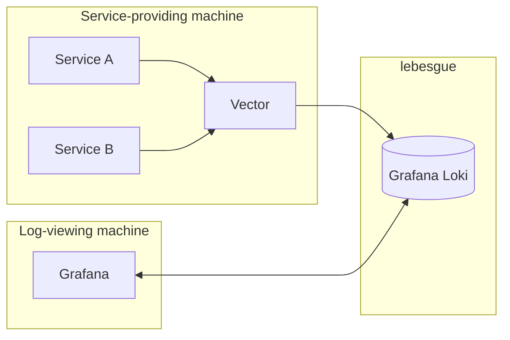

# Homelab Refresh 004 - Logging Execution

#### Benjamin Godfrey

As per my ramblings on logging, we have settled on the following architecture.



Now we need to go about the business of making this happen. To me, it makes sense for Loki to be the first thing we set up. Vector will need somewhere to point to, and Grafana will need something to fetch from. Also, having something running on `lebesgue` is 

## Loki Installation

As with most popular tools, Grafana Loki has [setup instructions](https://grafana.com/docs/loki/latest/setup/install/local/) available to us. Let's just try to follow these. Since I am installing Loki on a Raspberry Pi running Raspian, I have access to `apt`. Luckily for us, there is an `apt` package for Loki. Before we can install this, however, we need to follow the instructions laid out [here](https://apt.grafana.com/) to add the package repository (this means that Loki is not available through `apt` as it is, we need to make it available ourselves):

```bash    
mkdir -p /etc/apt/keyrings/
wget -q -O - https://apt.grafana.com/gpg.key | gpg --dearmor > /etc/apt/keyrings/grafana.gpg
echo "deb [signed-by=/etc/apt/keyrings/grafana.gpg] https://apt.grafana.com stable main" | tee /etc/apt/sources.list.d/grafana.list
```

With the minor addition of a few `sudo`s, this went through without issue. Now we can move on to the actual installation. Quite simple, just a `sudo apt update` and `sudo apt install loki`. Without too much drama, we are done.

With any installation it is good to make sure that the thing has installed correctly. For us, we can run `loki` and see what happens.

```
[loki.c:254] No parameter file specified
```

Uh oh. No good. Clearly something has gone wrong in our setup, or more precisely, something has not been set up. A quick google of this error message gives us the top result of a page on `grafana.com` entitled "Grafana Loki configuration parameters", which seems a sensible response.

This page points towards having a `loki.yaml` file, which make sense. It also gives us a nice example for a local configuration:

```yaml

# This is a complete configuration to deploy Loki backed by the filesystem.
# The index will be shipped to the storage via tsdb-shipper.

auth_enabled: false

server:
  http_listen_port: 3100

common:
  ring:
    instance_addr: 127.0.0.1
    kvstore:
      store: inmemory
  replication_factor: 1
  path_prefix: /tmp/loki

schema_config:
  configs:
    - from: 2020-05-15
      store: tsdb
      object_store: filesystem
      schema: v13
      index:
        prefix: index_
        period: 24h

storage_config:
  filesystem:
    directory: /tmp/loki/chunks
```

Some more reading seems to suggest this file should live in `/etc/loki/loki.yaml`. I do not currently have a `/etc/loki` directory, but we can make it and give it a shot.

After setting this config file and poking around a little more, I still could not get any further. I kept on coming up against error messages which didn't seem to make sense. The one which seemed very telling was one I found after trying something I dug out of the docs for Loki, that is, running `loki --config=/path/to/config`. On this, I found my new error message was along the lines of `unexpected character -`. This was very confusing, especially as I had been following official Loki documentation. To try and answer some of these newly found questions, I checked `man loki`. All of a sudden, something clicked. On the man page, I saw the following title:

loki - Reversible jump MCMC linkage analysis in general pedigrees

That does not seem right. No mention of Grafana, no mention of logging, no sign of anything I would have expected. I had installed the wrong loki. What was worse, I could not find a way of installing the right one. The package which `apt` have found me was clearly something quite old, and not down the right tracks at all, but I was not finding any alternative either.

Now, I clearly need to change my approach. I know that running a Docker container on the Raspberry Pi 1 will be a challenge, but Docker would make things simple. I am going to make a note to myself here and put a temporary fix in place. I will use Docker, but on a different machine - `zorn`, my desktop machine.

The steps here are going to be a tad simpler. Especially as they are all documented [here](https://grafana.com/docs/loki/latest/setup/install/docker/). We will follow these steps, and test with `curl http://localhost:3100/ready`. Once we have a `ready` response we are happy.

This installation has not gone as simply as we would have hoped, but we have Loki up and running now. At the very least we can continue with the rest of the setup for now.

## Grafana Installation

Next up is Grafana. For this step we will follow in some familiar footsteps, a Docker container running on `zorn`. As is documented [here](https://grafana.com/docs/grafana/latest/setup-grafana/installation/docker/), we can simply run `docker run -d -p 3000:3000 --name=grafana grafana/grafana-enterprise`. This installation (as you might expect) went a lot smoother. Once the image had been pulled and started up, we are sorted. Grafana is up and available at `http://zorn:3000`. We can go here, log in with our default `admin:admin` login, and there we have it.

At this step, we can also confirm that the previous Loki installation was successful, as we can connect Loki as a data source. We can navigate to connections > data sources > add new data source Loki, point it towards the relevant address (for me, `http://zorn:3100`), and there we have it. As a final sanity check, we can manually push some log to Loki, and verify that it turns up in Grafana.

```bash
curl -X POST -H "Content-Type: application/json" \
            -d '{
          "streams": [
            {
              "stream": {
                "label": "my-manual-test",
                "environment": "development"
              },
              "values": [
                [ "<current time in unix microseconds format>", "This is a manually pushed log message." ]
              ]
            }
          ]
        }' http://<loki address>/loki/api/v1/push
```

Send off this cURL, look at your Grafana logs, and with a bit of luck, we are sorted.

## Vector Installation

As previously mentioned, all of my machines are either Debian or Ubuntu machines, meaning that I can use `apt` to install Vector. This method of installation is available [here](https://vector.dev/docs/setup/installation/package-managers/apt/). 

Now that we have this installed, we can get to work with installation. For me, I want my docker logs to be sent off to loki. Poking around a little bit, I can settle on this as my `/etc/vector/vector.yaml` config:

```yaml
sources:
  docker_logs:
    type: docker_logs

transforms:
  add_host:
    type: remap
    inputs:
      - docker_logs
    source: |
      .host = get_hostname!()

sinks:
  loki:
    type: loki
    inputs:
      - add_host
    endpoint: http://192.168.1.124:3100
    encoding:
      codec: text
    labels:
      job: vector
      host: "<machine's name here, whatever it may be>"
```

In theory, I should be able to start up the vector service using `systemctl` by firing off a `systemctl start vector` command. In line with the precident which has been set, we meet some errors at this point. In particular, looking at the logs for vector after trying to start it, we can see that it is closing pretty soon after it is started. There is not so much a blatant error at play, it just seems that Vector is not staying alive. After some digging, I decided that I need to explicity tell systemctl to treat Vector as a service and keep it alive. We can do this with a `systemctl edit vector` update:

```
[Service]
ExecStart=
ExecStart=/usr/bin/vector --config-yaml /etc/vector/vector.yaml --watch-config
Restart=always
RestartSec=2
```

After this update, we are getting further. Now the logs show Vector staying alive but posting some permission errors. These are nicer. We can add the vector service account to the docker group with `sudo usermod -aG docker vector`, and hope that Vector will start up ok here.

At long last, we are sorted, Vector shows some nice green logs. To make things even better, we can go to Grafana at this point and see logs being posted from our Docker images for Grafana and Loki. The job's a good one.

#### Appendix - Future-proofing

In reading the steps outlined in setting up my logging solution, you might think to yourself "why bother?". I certainly have thought that myself a good few times. After all of this we have our logs for two Docker containers, which we would have been able to get a hold of fairly easily anyway.

The point is not in what we have just now. The point is that we have a solid foundation. My config for Grafana and Loki is set up such that logs from many services and many machines can be shown consistently and easily. The Vector install will be required on each machine, but the config should be able to stay fairly consistent across all of them. We have built a system that can be (and will be) extended. If we can make choices today that will help us not just tomorrow, but for many days after, we are doing a good job.